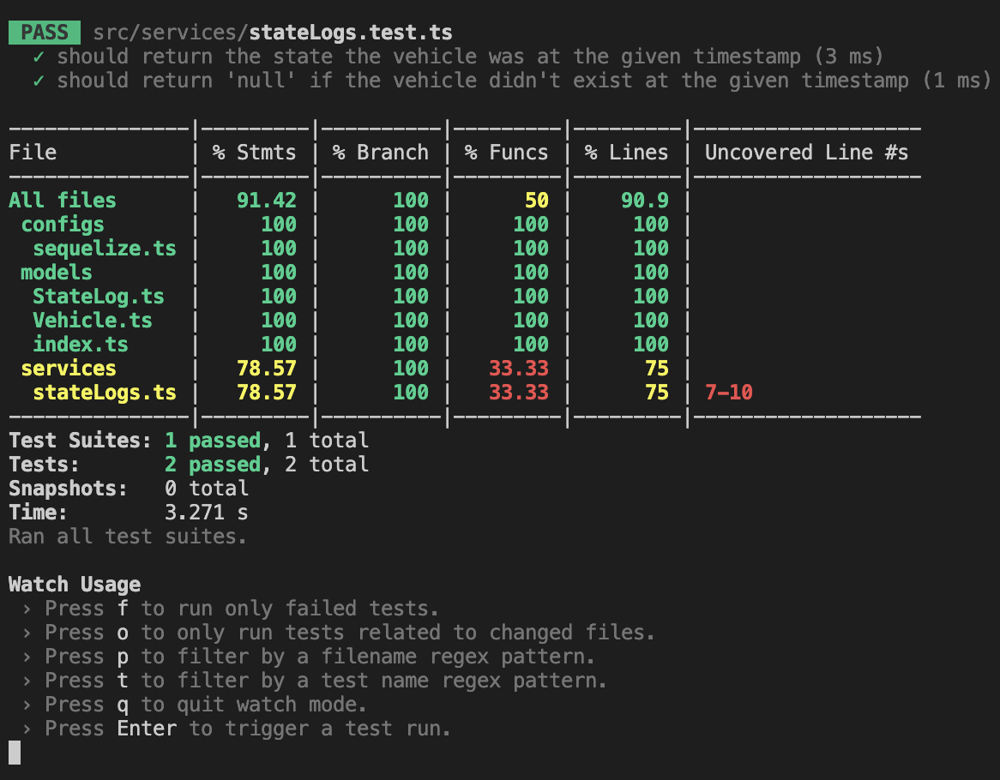

# Senior Backend Engineer Tech Challenge

## 1. Description

Please download below the starter package to save you time with the basic setup of this challenge.

-   You'll need Docker to spin up the test database.
-   You may use any package you like.
-   You may use JavaScript or TypeScript.

Inside this package, you will find a git project containing a Docker file that will bring up a Postgres database containing 2 tables: `vehicles` and `stateLogs`. These tables are already populated with some sample data.

The `vehicles` table has the data of cars that Motorway has sold in the past, or is in the process of selling. The vehicle's current state is defined in the `state` field. The state defines the lifecycle of a vehicle, from quoted to selling and sold.

The `stateLogs` table has the history of each vehicle's state transitions, from the moment it was created with the quoted state, to the most recent state transition.

Your task is to build an API with Node.js that, based on a vehicle id and a timestamp, returns a vehicle's information and the vehicle's state on the given timestamp.

For example, for the following `stateLogs`:

```json
[
    {
        "vehicleId": 3,
        "state": "quoted",
        "timestamp": "2022-09-11 09:11:45+00"
    },
    {
        "vehicleId": 3,
        "state": "selling",
        "timestamp": "2022-09-11 23:21:38+00"
    },
    {
        "vehicleId": 3,
        "state": "sold",
        "timestamp": "2022-09-12 12:41:41+00"
    }
]
```

if the API receives the timestamp `2022-09-12 10:00:00+00`, the response is the vehicle data, and the state of `selling` because it's the state that the vehicle was on that point in time.

Imagine this API endpoint is in a production environment and can be hit multiple times a second. It’s acceptable that clients can get a response stale by 1 minute.

Please prepare your project as you would for a production environment, considering reliability (this app would run in multiple instances), and testing.

## 2. Initial thoughts on the requirements

After reading the requirements multiple times, these are my design considerations.

### 2.1 Run postgres database in Docker

> Inside this package, you will find a git project containing a Docker file that will bring up a Postgres database containing 2 tables: `vehicles` and `stateLogs`. These tables are already populated with some sample data.

Two options came to mind:

1. A serverless application with Amazon RDS for PostgreSQL, fronted by a database proxy, with AWS Lambda and API Gateway
2. A containerised application with services running in Docker containers

The best database for serverless applications is DynamoDB, since it can scale infinitely as well as Lambda. RDS databases, on the other hand, are not designed to accept the same number of concurrent connections - needing a database proxy in front of them.

This is why I have chosen to go for a containerised approach, with services running in Docker containers.

### 2.2 Build an API

> Your task is to build an API with Node.js that, based on a vehicle id and a timestamp, returns a vehicle's information and the vehicle's state on the given timestamp.

Three options came to mind:

-   REST API with AWS API Gateway
-   REST API with Express
-   GraphQL API

There were no requirements to justify going for a GraphQL API.

Because of the same reason I have explained above, I have opted to avoid using API Gateway. As a Node.js server, I have chosen Express.js since it is already used at Motorway.

RESTful API design principles:

-   Since the resource we want to return is a `Vehicle`, the url starts with the resource plural name and id parameter: `/vehicles/:vehicleId`
-   Since we want to return the state the vehicle was at a given timestamp, the url becomes: `vehicles/:vehicleId/timestamp/:timestamp`
-   Since it is a query the HTTP method is **GET**

### 2.3 Accept stale response by 1 minute

> Imagine this API endpoint is in a production environment and can be hit multiple times a second. It’s acceptable that clients can get a response stale by 1 minute.

Two options came to mind:

-   Amazon DynamoDB Accelerator (DAX)
-   Redis in-memory cache

Since I am not going for a serverless approach, I have picked Redis, which is also a caching technology already used at Motorway.

The principle is:

-   The user makes an API request
-   Does Redis contain the asking query?
-   If yes, return that straight away
-   If not, make the database queries and, before returning, save the API response in Redis with a key of `vehicleId + timestamp`

### 2.4 Ensure reliability

> Please prepare your project as you would for a production environment, considering reliability (this app would run in multiple instances), and testing.

To make sure the application is of production grade, the application will be deployed using AWS Elastic Beanstalk, which is also already used at Motorway.

To ensure reliabity, the EC2 instances and ALB will need to deployed in multiple availability zones.

PM2 will also be used to manage and daemonize applications (run them in the background as a service).

To handle concurrent requests, EC2 instances will be wrapped in AWS autoscaling groups. In addition, a production process manager like pm2 will be used to handle monitoring.

## 3. Installation

Locally the application runs in Docker. Docker compose is used to spin up 4 services: `api` (Express server), `db` (development postgres database), `db-test` (test postgres database) and `redis-cache` (caching database).

1. Clone the repository and run `npm install`
2. Then, run `docker-compose build` to build the Docker image
3. Then, run `docker-compose up` to start up the services and seed the databases
4. The server should be up and running at `http://localhost:3000/`
5. Test the API endpoint with this query `http://localhost:3000/vehicles/2/timestamp/2022-09-19%2010:00:00+00`
6. The first time, it should return this data

```json
{
    "fromCache": false,
    "data": {
        "vehicle": {
            "id": 2,
            "make": "AUDI",
            "model": "A4",
            "state": "selling"
        }
    }
}
```

7. The second time, it should return `"fromCache": true`

```json
{
    "fromCache": true,
    "data": {
        "vehicle": {
            "id": 2,
            "make": "AUDI",
            "model": "A4",
            "state": "selling"
        }
    }
}
```

### 4. Testing

Unit tests can be run with the command: `npm test`



## 5. Technologies used

Development:

-   ESLint
-   TypeScript
-   Node
-   Jest
-   Express
-   Postgres
-   Sequelize
-   Redis
-   Docker

Production (no implementation as of now):

-   AWS Elastic Beanstalk
-   Amazon ElastiCache for Redis
-   Amazon Aurora PostgreSQL

I use all technologies above at my current job apart from Express, Sequelize and Redis, which I picked for personal learning and also because they are used at Motorway.

## 6. CI / CD Pipelines

Pipelines are built with GitHub actions.

So far, I have only built the `test` job.

## 7. Schedule

I have worked on this tech test roughly 1 - 2 hours a day in the evenings.

-   Monday 27th March
    -   Call with Motorway internal recruiter
-   Tuesday 28th March
    -   Initialise TypeScript project
    -   Setup Express server
    -   Setup folder structure with routes, controllers and services
-   Wednesday 29th March
    -   Setup Sequelize models
    -   Configure environment variables to connect to databases
    -   Design docker-compose to create development services
-   Thursday 30th March
    -   Design REST API
    -   Setup Jest testing
    -   Complete business logic and unit tests
-   Friday 31st March
    -   Setup Redis cache to work as Express middleware
-   Saturday 1st April
    -   Write documentation
-   Sunday 2nd April
-   Monday 3rd April

## 8. What I would add if I had more time

-   Different brances for staging and production deployments
-   Infrastructure as code with Terraform
-   Testing API routes and controllers
-   Different AWS account for each deployment environment
